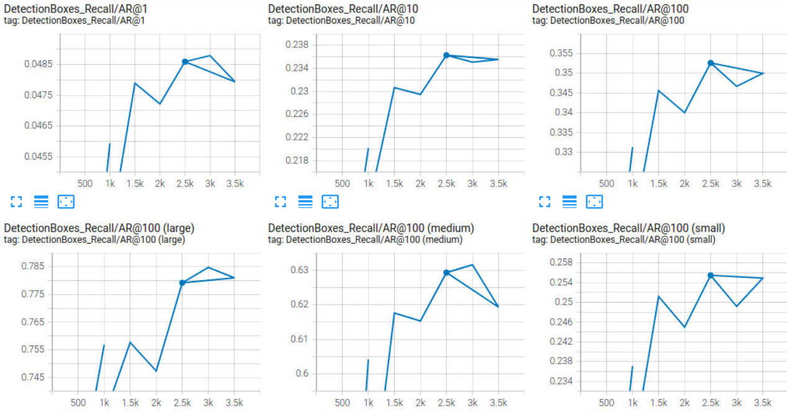

# Project 1. Object detection in an Urban Environment
## Project overview
This project is devoted to study object detection techniques applicable to self-driving cars industry.
Namely it deals with detection of three type of objects: cars, pedestrians and cyclists in different environments: roads, highways, crossroads etc.
This task is very important for self-driving cars, because images taken by cameras (along with information from lidars and radars) are the key means that provide automotive AI with the information needed to correctly identify the car position relative to other road objects. 

The goal of this project is to train 3-class Object detection model which is able to identify position of a car, a pedestrian or a cyclist based on Waymo Open Dataset using Tensorflow Object Detection API.

## Instructions
1. Clone the git repository to your local machine and go to the Project 1 directory 
```console
git clone https://github.com/evefim/Udacity_Self-Driving_car.git
cd Self-driving_car/Project_1
```

2. In order to run the project the docker container is used. Build the image and run the container using the following commands:
```console
cd build
docker build -t project-dev -f Dockerfile .
docker run --gpus all -v <local path to repository>/Self-driving_car/Project_1/:/app/project/ --network=host -ti project-dev bash
```
In my case local path to repository is ```/home/evgeny/udacity```.

When the container is started go to the ```/app/project``` directory
```console
cd /app/project
```

3. Download the dataset using [download_process.py](download_process.py) script.
```console
python download_process.py --data_dir data/waymo --size 100
```
This script will create ```train```, ```val```, ```training_and_validation``` and ```test``` directories, download 100 tfrecord files and put 3 of them to  ```test``` folder and remaining 97 files to ```training_and_validation``` folder.

4. These 97 files should be splitted between ```train``` and ```val``` folders by running [create_splits.py](create_splits.py) script.
```console
python create_splits.py --data_dir data/waymo
```

To make training and validation splits balanced this script needs file ```validation.txt``` which is produced by [Exploratory Data Analysis.ipynb](Exploratory%20Data%20Analysis.ipynb) notebook. The files in ```training_and_validation``` are split in proportion 85/15 between ```train``` and ```val``` directories. More detailed description of the algorithm can be found in Cross validation section below. The ```validation.txt``` file is in the repository, but it can be created from scratch with different split by running [Exploratory Data Analysis.ipynb](Exploratory%20Data%20Analysis.ipynb) notebook.

5. Download the pretrained models to the ```experiments/pretrained_model``` folder from [Tensorflow Object Detection model zoo](https://github.com/tensorflow/models/blob/master/research/object_detection/g3doc/tf2_detection_zoo.md).
In this case three models are used: ```ssd_resnet50_v1_fpn_640x640```, ```ssd_resnet50_v1_fpn_1024x1024```, ```faster_rcnn_resnet50_v1_1024x1024```.
```console
cd experiments
mkdir pretrained_model
cd pretrained_model
wget http://download.tensorflow.org/models/object_detection/tf2/20200711/ssd_resnet50_v1_fpn_640x640_coco17_tpu-8.tar.gz
tar -xzf ssd_resnet50_v1_fpn_640x640_coco17_tpu-8.tar.gz
wget http://download.tensorflow.org/models/object_detection/tf2/20200711/ssd_resnet50_v1_fpn_1024x1024_coco17_tpu-8.tar.gz
tar -xzf ssd_resnet50_v1_fpn_1024x1024_coco17_tpu-8.tar.gz
wget http://download.tensorflow.org/models/object_detection/tf2/20200711/faster_rcnn_resnet50_v1_1024x1024_coco17_tpu-8.tar.gz
tar -xzf faster_rcnn_resnet50_v1_1024x1024_coco17_tpu-8.tar.gz
cd ../..
```

6. Download corresponding pipeline configuration from [this page](https://github.com/tensorflow/models/tree/master/research/object_detection/configs/tf2). 
```console
wget https://raw.githubusercontent.com/tensorflow/models/master/research/object_detection/configs/tf2/ssd_resnet50_v1_fpn_640x640_coco17_tpu-8.config
wget https://raw.githubusercontent.com/tensorflow/models/master/research/object_detection/configs/tf2/ssd_resnet50_v1_fpn_1024x1024_coco17_tpu-8.config
wget https://raw.githubusercontent.com/tensorflow/models/master/research/object_detection/configs/tf2/faster_rcnn_resnet50_v1_1024x1024_coco17_tpu-8.config
```
In downloaded .config several changes must be made:
- In the ```train_config``` section ```fine_tune_checkpoint_type``` must be set to ```"detection"``` instead of ```"classification"```
- In the ```train_config``` section ```use_bfloat16``` must be set to ```false```
- File must be renamed to ```pipeline.config```

The configuration file ```pipeline.config``` should be edited by [edit_config.py](edit_config.py) script to include correct values for training and validation dataset and batch size.
```console
python edit_config.py --train_dir data/waymo/train/ --eval_dir data/waymo/val/ --batch_size 2 --checkpoint experiments/pretrained_model/ssd_resnet50_v1_fpn_640x640_coco17_tpu-8/checkpoint/ckpt-0 --label_map experiments/label_map.pbtxt
```
This command will produce ```pipeline_new.config``` file with correct input.
Directories in the ```experiments``` folder already contain ```pipeline_new.config``` files for performed experiments. 

7. Create new folder for the experiment and move created  ```pipeline_new.config``` to this folder.
```console
mkdir experiments/experiment1
mv pipeline_new.config experiments/experiment1
```

8. Launch training using script [model_main_tf2.py](experiments/model_main_tf2.py)
```console
python experiments/model_main_tf2.py --model_dir=experiments/experiment1 --pipeline_config_path=experiments/experiment1/pipeline_new.config
```
To monitor the training, you can launch a tensorboard instance by running 
```console
python -m tensorboard.main --logdir experiments/experiment1
```

9. Once the training is finished, launch the evaluation process using the same script
```console
python experiments/model_main_tf2.py --model_dir=experiments/experiment1 --pipeline_config_path=experiments/experiment1/pipeline_new.config --checkpoint_dir=experiments/experiment1
```
10. Export the trained model
```console
python experiments/exporter_main_v2.py --input_type image_tensor --pipeline_config_path experiments/experiment1/pipeline_new.config --trained_checkpoint_dir experiments/experiment1/ --output_directory experiments/experiment1/exported/
```

This should create a new folder ```experiments/experiment1/exported/saved_model```. You can read more about the Tensorflow SavedModel format [here](https://www.tensorflow.org/guide/saved_model)

11. Finally, you can create a video of your model's inferences for any tf record file. To do so, run the following command:
```console
python inference_video.py --labelmap_path label_map.pbtxt --model_path experiments/experiment1/exported/saved_model --tf_record_path data/waymo/test/segment-12200383401366682847_2552_140_2572_140_with_camera_labels.tfrecord --config_path experiments/experiment1/pipeline_new.config --output_path animation.gif
```
## Dataset
The dataset consists of 100 tfrecord files from the [Waymo Open dataset](https://waymo.com/open/). The files can be downloaded directly from the website as tar files or from the [Google Cloud Bucket](https://console.cloud.google.com/storage/browser/waymo_open_dataset_v_1_2_0_individual_files/) as individual tf records.

### Dataset analysis
The dataset analysis is given in the Jupyter notebook [Exploratory Data Analysis.ipynb](Exploratory%20Data%20Analysis.ipynb)

Some conclusions are summarized below:
- There are different weather, daytime and road conditions. This is good from the model generalization ability point of view.  
- Three classes (a car, a pedestrian and a cyclist) are very imbalanced. In 1937 images there are 34855 cars, 10423 pedestrians and 270 cyclists. This fact makes cyclists very difficult to detect (or in other words to teach the model to identify them).
- One image may contain a lot of detections, in the given subset there are up to 75 bounding boxes in a single image. Some images are empty, which is also valid event.
- The scale of objects bounding boxes is also very different from very huge (for example, very long bus in a foreground) to tiny pedestrians in the distance.
- There are also some errors in dataset (not many though): wrong bounding boxes, objects without bounding boxes.

### Cross validation
Dataset should be split into 3 subsets: for training (train), validation (val) and testing (test).
Initially, 97 of these files are in the folder train_and_val and 3 files were put aside for testing.
Remaining 97 files should be splitted into two parts: training and validation. The ratio 85/15 was chosen to have a reasonable number of files in both sets.
As was shown above, the classes are very imbalanced, so instead of random split of train_and_val files into two categories, the total number of every kind of objects is maintained close to 85/15 split.

The procedure implemented in the [Exploratory Data Analysis.ipynb](Exploratory%20Data%20Analysis.ipynb) is following:

0. Count number of cars, pedestrians and cyclists in each file.
1. Split the whole dataset into two groups: containing a cyclist type of object and not. 
2. Count the number of files containing cyclists, in this case it is 27.
3. Split this number also in proportion 85/15, so for validation we need to take 4 (0.15 * 27) files with cyclists and 11 (0.15 * 70) files without cyclists.
This is done in order to have different files with cyclists for better generalization.
4. Randomly permute lists of files with and without cyclists and take from this lists 4 and 11 files, respectively, for validation and remaining files for training.
5. Continue step 4 until the total number of all types of objects is split in proportion 85/15 for training and validation sets.
6. Save filenames for validation set in validation.txt. 
7. Run [create_splits.py](create_splits.py) script to perform real dataset split.

This procedure is quite straightforward and it does not take into account another important factors, for example, diversity of weather and/or daytime conditions, but it tries to deal with imbalanced dataset. Another idea is that different ration between training and validation can be used (for example, 90/10), to have more data for training.

## Model training
The training was performed on 1 Tesla K80 (12 GB) using Udacity workspace so there were some limitations on available disk space (3 GB), GPU memory and total train time. 

### Metrics summary
Here all metrics are summarized for the performed experiments, the detailed description of each experiments is given below. 
The best results are marked bold.

| Precision/Recall | area | maxDets | Reference | Exp. 1 | Exp. 2 | Exp. 3 | Exp. 4
|-------|--------|--------|-------|--------|---------|----------|---------|
 Average Precision  (AP) @[ IoU=0.50:0.95] |    all | 100 | 0.000|0.217 | 0.228 | **0.282** | 0.273
 Average Precision  (AP) @[ IoU=0.50 ]     |    all | 100 | 0.001|0.397 | 0.423 | **0.540** | 0.534
 Average Precision  (AP) @[ IoU=0.75 ]     |    all | 100 | 0.000|0.200 | 0.212 | **0.257** | 0.236
 Average Precision  (AP) @[ IoU=0.50:0.95 ]| small | 100 | 0.000|0.100 | 0.101 | **0.181** | 0.156
 Average Precision  (AP) @[ IoU=0.50:0.95 ]| medium | 100 | 0.002|0.505 | 0.541 | 0.548 | **0.568**
 Average Precision  (AP) @[ IoU=0.50:0.95 ]| large | 100 | 0.002|**0.865** | 0.854 | 0.680 | 0.748
 Average Recall     (AR) @[ IoU=0.50:0.95 ]|  all |  1 | 0.000|**0.077** | 0.074 | 0.047 | 0.049
 Average Recall     (AR) @[ IoU=0.50:0.95 ]|  all |  10 | 0.002|0.213 | 0.229 | **0.243** | 0.235
 Average Recall     (AR) @[ IoU=0.50:0.95 ]|  all | 100 | 0.007|0.294 | 0.305 | **0.356** | 0.347
 Average Recall     (AR) @[ IoU=0.50:0.95 ]| small | 100 | 0.000|0.174 | 0.185 | **0.266** | 0.249
 Average Recall     (AR) @[ IoU=0.50:0.95 ]| medium | 100 | 0.001|0.607 | 0.602 | 0.624 | **0.632**
 Average Recall     (AR) @[ IoU=0.50:0.95 ]| large | 100 | 0.113|**0.893** | 0.877 | 0.733 | 0.785

### Reference experiment
The reference experiment was performed using the config for a SSD Resnet 50 640x640 model from Tensorflow Object Detection API with the [default config](experiments/reference/pipeline_new.config).

The training metrics after 3000 training steps are shown in the Table.
 
 It can be seen that performance of this model extremely poor, although it is able to detect some large objects.
 The reason is that this model hardly learns something, as can be seen from the graph showing loss during training.


There are two obvious weak points: 
- the small batch size of 2 is used for model training (default value) 
- the learning rate is not tailored to the problem

So, before going deeper into augmentations and model architecture selection these points should be addressed.

### Experiment 1 (Adam optimizer, exponentially decaying learning rate and increased batch size)
The same SSD Resnet 50 640x640 model from Tensorflow Object Detection API was used with the following changes:
- Adam optimizer is used
- Exponentially decaying learning rate is employed: each 100 steps LR is multiplied by 0.95
- Batch size is increased up to 10 (limited by GPU memory) 

The full configuration file is available [here](experiments/experiment1/pipeline_new.config).
The process of training is quite stable, and both training and validation losses are decreasing up to 3000 step.
Metrics at different time steps are given in the [file](experiments/experiment1/result.txt).


At the same time object detection metrics start to decrease after 2500 step.


Thus, the model at 2500 step is chosen as the final model and metrics for this step are shown in the Table.

Some conclusions can be made based on test metrics and test animations:
- Model is quite good at detecting and classifying large and medium objects in good weather conditions
- It is hard for the model to detect small objects
- In night conditions detection of medium poorly lit objects is not stable

### Experiment 2 (Data augmentations)
The same SSD Resnet 50 640x640 model from Tensorflow Object Detection API was used.
In the experiment 1 only random horizontal flip and random crop were used for augmentations.
In this experiment some more augmentations defined in [Tensoflow OD API](https://github.com/tensorflow/models/blob/master/research/object_detection/protos/preprocessor.proto) were used.
Some images with augmentations can be seen in 
The full list of used augmentations is given below:
- random_horizontal_flip
- random_distort_color
- random_adjust_brightness
- random_adjust_contrast
- random_jitter_boxes
- ssd_random_crop.

Pipeline config used for training is [here](experiments/experiment2/pipeline_new.config).

The process of training is quite stable, and both training and validation losses are decreasing up to 4000 step.
Metrics at different time steps are given in the [file](experiments/experiment2/result.txt).


At the same time object detection metrics start to decrease after 3000 step, so model starts to overfeat on training data.


Thus, the model at 3000 step is chosen as the final model and metrics for this step are shown in the Table. 

The following conclusions can be made based on animations and metrics:

- Using augmentations allows longer model training without overfitting on training data
- Some metrics increase (e.g. precision/recall for medium objects) which results in better detection
- This model better detects pedestrians
- Surprisingly, this model works worse at night, so augmentations should be more carefully selected

### Experiment 3 (Size of model input)
The SSD Resnet 50 1024x1024 model from Tensorflow Object Detection API was used with the same augmentations as in the Experiment 2.
Due to a larger input size and larger model size, the batch size was decreased to 4.

Pipeline config used for training is [here](experiments/experiment3/pipeline_new.config).

The process of training is quite stable, and both training and validation losses are decreasing up to 4500 step.
Metrics at different time steps are given in the [file](experiments/experiment3/result.txt).


At the same time object detection metrics start to saturate after 4000 step, so training process was stopped at this point.


Thus, the model at 4000 step is chosen as the final model and metrics for this step are shown in the Table. 

The following conclusions can be made based on animations and metrics:

- Using larger input size allows longer model training without overfitting on training data
- Some metrics increase (e.g. precision/recall for medium objects) which results in better detection
- This model better detects pedestrians
- Surprisingly, this model has more false detections, seen e.g. in the animation for the segment 3. 

### Experiment 4 (Different architecture)
For comparison, the Facter R-CNN Resnet 50 1024x1024 model from Tensorflow Object Detection API was used with the same augmentations as in the Experiment 2.
Due to a larger input size and larger model size, the batch size was decreased to 4.

Pipeline config used for training is [here](experiments/experiment4/pipeline_new.config).

The process of training is quite stable but very noisy, and both training and validation losses are decreasing up to 3500 step.
Metrics at different time steps are given in the [file](experiments/experiment4/result.txt).


At the same time object detection metrics start to saturate after 3500 step, so training process was stopped at this point.




Thus, the model at 3000 step is chosen as the final model and metrics for this step are shown in the Table. 

The results and conclusions are similar to SSD 1024x1024 can be made based on animations and metrics:

- Using larger input size allows longer model training without overfitting on training data
- Some metrics increase (e.g. precision/recall for medium objects) which results in better detection
- This model better detects pedestrians
- Surprisingly, this model has more false detections, seen e.g. in the animation for the segment 3.

### Other experiments
Some other architectures were tested, but have not lead to meaningful results:
- EfficientDet D1 640x640 - results were worse than in the Experiment 2 (SSD 640x640). Possibly, another optimizer/augmentations should be used.
- EfficientDet D4 1024x1024 - the batch size was reduced to 2, loss during training was wery noisy.
- SSD Resnet 152 1024x1024 - the training process was unstable. Possibly, another optimizer/augmentations should be used.

Another approach with per class metrics calculations was also tested, but it required pathcing Tensorflow code, which is unfortunately can not be done in the Udacity workspace.

### Test animations
#### Segment 1

| | |
|--|--|
|Exp. 1. SSD 640x640 <br /> |Exp. 2. SSD 640x640 + augmentations <br />|
|Exp. 3. SSD 1024x1024 + augmentations<br />|Exp. 4. Faster R-CNN 1024x1024 + augmentations<br />|
#### Segment 2
| | |
|--|--|
|Exp. 1. SSD 640x640 <br /> |Exp. 2. SSD 640x640 + augmentations <br />|
|Exp. 3. SSD 1024x1024 + augmentations<br />|Exp. 4. Faster R-CNN 1024x1024 + augmentations<br />|

#### Segment 3
| | |
|--|--|
|Exp. 1. SSD 640x640 <br /> |Exp. 2. SSD 640x640 + augmentations <br />|
|Exp. 3. SSD 1024x1024 + augmentations<br />|Exp. 4. Faster R-CNN 1024x1024 + augmentations<br />|

## Conclusions
In this project Tensorflow Object Detection API was used to train a model for detecting cars, pedestrians and cyclists in an urban environment. 
Two different architectures SSD and Faster R-CNN were used and showed similar performance. The usage of augmentations allowed achieving reasonable precision and recall even on a small dataset. 
